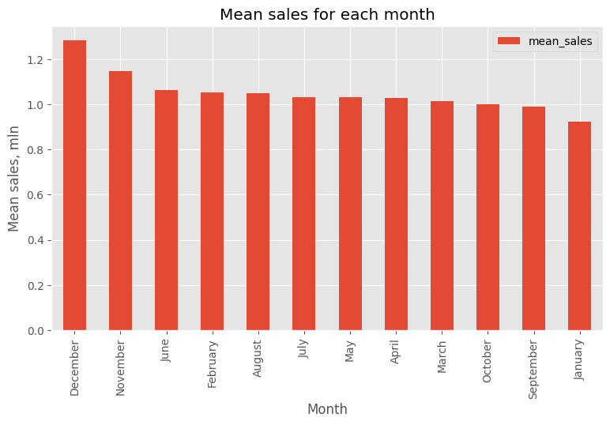

# 🛒 Walmart Data Analysis
This project is focused on analyzing yearly sales data from the Walmart store network. Walmart is an American chain of supermarkets and hypermarkets that offers a wide range of goods at low prices. The company has thousands of stores around the world. The goal of this project is to find seasonal sales trends, compare stores with each other, and find the impact of holidays, economic factors, and weather on sales.


# 📁 Project Structure

```
Walmart-Data-Analysis
├── images/
├── README.md
├── Walmart.csv
├── analisys.ipynb
```

- images/ folder with images used in the README
- README.md provides project overview and instructions.
- Walmart.csv source data.
- alalisys.ipynb jupyter notebooks with whole project. 


# 📊 Dataset 
The dataset used is a publicly available dataset from Kaggle called 'Walmart Dataset'. It contains historical sales data from 45 different Walmart stores for the period from 2010-02-05 to 2012-11-01. The dataset has 6435 rows and 8 columns. <br>

The columns are:<br>

Store – store ID<br>
Date – end date of the week<br>
Weekly_Sales – sales for the given week<br>
Holiday_Flag – 0 means a regular week, 1 means there is a holiday in that week<br>
Temperature – average temperature for the given week<br>
Fuel_Price – fuel price in the region for that week<br>
CPI – prevailing consumer price index in the region for that week<br>
Unemployment – prevailing unemployment rate in the region for that week<br>

Source: https://www.kaggle.com/datasets/yasserh/walmart-dataset


# 📉 Data Analysis and Visualization

The goal of data analysis and visualization in our case is to answer these questions:<br>

1. Which store had the highest sales?
2. Which month has the highest sales?
3. What is the yearly sales trend?
4. How sales values are spread out?
5. How holidays affect sales?
6. Top 10 weeks with the highest average profit.
7. Which holiday week has the highest sales?
8. How economic and weather factors in the region influence sales?
9. How temperature affects sales?
10. How the unemployment rate in the region affects sales?
11. How fuel price affects sales? <br><br>


## 1. Which store had the highest sales? <br>

 <br>

This graph shows the total sales of each store. We see that store 20 sold the most, while stores 4, 14, 13, 2, 10, and 27 also have very high sales – more than 250 million. The store with the lowest sales is store 33, with less than 50 million. We can see a big difference in sales values of some stores, for example, between store 33 and store 20 it is more than 6 times. Later, we will look at how economic factors and weather affect these sales.  <br><br>


## 2. Which month has the highest sales? <br>

 <br>

This graph shows the average sales for each month. We see that December and November have the highest values, probably because these months have the biggest holidays like Thanksgiving, Christmas, and New Year. On later graphs, we will look at how holidays affect sales. The lowest sales are in January, probably because in the two months before people spent the most money. In the middle are the sales in June to September, and the sales in these months are almost the same.


## 3. What is the yearly sales trend? <br>

 <br>  

This graph shows how sales change during the year. We see, as in the previous graph, that sales grow a lot at the end of the year, drop at the beginning, and stay almost the same during the other weeks with some local highs and lows. <br><br>


Other charts and their interpretations are available in the Jupyter Notebook.


# 💡 Business Insights & Recommendations

1. Holiday weeks drive significant sales growth. <br>

    Before holidays, sales increase a lot. <br>
    Recommendation: Increase advertising campaigns and discount offers before holidays to maximize profit. <br><br>

2. Store performance varies widely. <br>

    Top stores by sales bring many times more profit than the others. <br>
    Recommendation: Study the practices of these stores and apply them to less profitable ones. <br><br>

3. Fuel prices show a weak/moderate correlation with sales. <br>

    Higher fuel prices can reduce store visits and therefore decrease sales in some weeks. <br>
    Recommendation: Offer extra incentives (for example, free delivery) when fuel prices are high. <br><br>

4. Sales show seasonal patterns. <br>

    There is a big increase in sales at the end of the year in November and December. <br>
    Recommendation: Plan to increase stock and staff during peak seasons. <br><br>

5. Temperature can affect sales. <br>

    At high temperatures, a decline in sales may occur. <br>
    Recommendation: Introduce seasonal promotions or special offers during periods of high temperatures to maintain sales levels.


# 🛠️ Tools Used

- Python (Pandas, NumPy, Matplotlib, Seaborn)
- Jupyter Notebook


## ⚡ Installation

1. Clone the repository: <br>

   `git clone https://github.com/TheDim0nu4/Walmart-Data-Analysis.git` <br>
   `cd Walmart-Data-Analysis` <br>
   
2. Create a Python virtual environment (optional but recommended): <br>

   `python -m venv venv` <br>

3. Install the required dependencies: <br>

   `pip install -r requirements.txt` <br>


# ✍️ Author

This project was implemented in the summer of 2025. The project was carried out by Dmytro Skrypchenkoю


